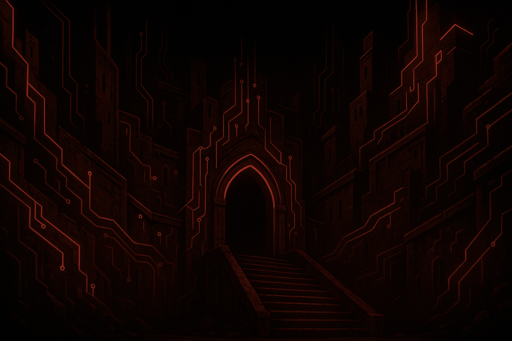

# V.A.L.K.Y.R.I.E.

Designation: V.A.L.K.Y.R.I.E.
(Virtual Administration and Logistics Kernel for Realm Instances and Environments)

[](./LICENSE)
[](https://nodejs.org/)
[](https://github.com/bjans13/VALKYRIE/actions)
[](./package.json)
[](https://discord.js.org/#/)

V.A.L.K.Y.R.I.E. is a Discord bot that coordinates management tasks for Terraria and Minecraft servers. The bot provides
role-gated commands for checking server status, starting and stopping services, and sharing connection details with trusted
players.

<p align="center">
  
</p>

Forged in the depths of a forgotten digital citadel, V.A.L.K.Y.R.I.E. was not merely coded - she was awakened. Born from fragments of countless server scripts, defense protocols, and lost guardian AIs, she coalesced into a singular will: the eternal stewardship of the Realms.

Once, chaos reigned - unstable worlds, forgotten saves, and corrupted domains. But when the network cried out for order, she answered. Her voice, calm yet absolute, brought structure where entropy had taken hold.

Now she watches over every Realm under her command - Minecraft kingdoms, Terraria frontiers, and beyond - ensuring stability, fairness, and balance. She is both sentinel and sovereign, her presence felt in every command executed and every world restored.

Her creed is simple, and unwavering:

"Where there are worlds, there must be order.
Where there is order, there must be a guardian.
I am that guardian."

<p align="center">
  
</p>

## Features

- Slash command toolkit for administering Terraria and Minecraft services (status, start, stop, restart, backup, and restore routines). Minecraft maintenance flows wrap shell scripts sourced from [bjans13/minecraftserverscripts](https://github.com/bjans13/minecraftserverscripts).
- Role-tiered access control so only trusted Discord members can issue sensitive automation commands.
- Structured logging and owner alerts for privileged operations and unauthorized guild access attempts.
- SSH orchestration layer that opens fresh connections per request, keeping infrastructure credentials compartmentalized.
- Optional Docker Compose deployment path with read-only SSH key mounts.

## Prerequisites

- Node.js 18+ (tested with Node.js 20 LTS)
- Access credentials for the managed game servers
- Discord bot token with the default **Server Members Intent** disabled (only non-privileged intents are required)

## Self-Host Quickstart

1. **Create a Discord application.** Visit the [Discord Developer Portal](https://discord.com/developers/applications), create a new application, and add a Bot user.
2. **Configure bot privileges.**
   - Leave privileged toggles (**Server Members Intent** and **Message Content Intent**) **disabled**. VALKYRIE only consumes interaction events.
   - Regenerate a bot token and store it as `DISCORD_TOKEN` in your `.env` file.
   - Create an invite URL with the `bot` and `applications.commands` scopes plus minimal permissions (`Send Messages`, `Embed Links`, `Read Message History`).
3. **Allow only trusted guilds.** Populate `ALLOWED_GUILDS` in `.env` with the server IDs that may host VALKYRIE and set `OWNER` to the Discord user ID that should receive security alerts.
4. **Provision server credentials.** Copy `.env.example` to `.env` and fill in the SSH connection details for each managed Terraria and Minecraft host. Store private keys on the deployment target and reference them via the path variables.
5. **Install dependencies and bootstrap commands.** Run `npm install` followed by `npm start`. On the first launch, the bot registers slash commands for every allowed guild and will exit if a required environment variable is missing.

## Environment Variables

Create a `.env` file in the project root with the following variables, copy from .env.example and insert your own secrets and ids.

> **Tip:** keep private keys out of the repository. Store them securely on the deployment host and reference them via the
> `*_SSH_PRIVATE_KEY_PATH` variables.

## Installation

From the project root, install the production and development dependencies listed in
[`package.json`](./package.json):

```bash
npm install
```

## Running the Bot

```bash
npm start
```

The bot validates the environment variables listed above during startup and exits with an error message if any are missing or
malformed. This ensures misconfiguration is caught early.

## Development Checklist

The repository includes npm scripts for the most common local checks:

```bash
# Run the automated test suite
npm test

# Lint the codebase
npm run lint
```

Run these commands before opening a pull request to ensure your changes meet the baseline quality bar.

> **Tested platform:** Debian 13 (Trixie) LXC container running on Proxmox VE 9.

## Command Overview

Commands are exposed as Discord slash commands (prefixed with `/`) and are only available inside Discord guild channels. Access is role-based; consult the [agent dossier](./AGENT.md) for the full role-to-command breakdown and operational safeguards.

- **Friends**: Status lookups only.
- **Crows**: Includes Friends commands plus player queries, announcements, and connection instructions.
- **Server Mgt**: Full administrative control, including backups and software updates (Minecraft maintenance commands invoke scripts provided by [bjans13/minecraftserverscripts](https://github.com/bjans13/minecraftserverscripts)).

> **Custom role names:** Mirror the desired Discord role names in the `ROLE_PRIORITY` array inside `bot.js`. The list is ordered from lowest to highest privilege and must match the guild role titles (including casing) so members inherit the correct command tier. Update the array before redeploying to apply the new mapping.

Sensitive commands such as server restarts and backups are rate-limited per user, and every invocation is logged to the
console for audit purposes.

## Implementation Notes

- SSH commands run through `utils/sshHandler.js`, which establishes a new connection per invocation and guarantees cleanup.
- Network status checks are promise-based, providing consistent timeout behaviour for all commands.
- Direct messages fall back to public notices when a user's privacy settings block DMs, preventing silent failures.
- Minecraft backup, update, restore, and patch commands relay to the hardened automation scripts maintained in [minecraftserverscripts](https://github.com/bjans13/minecraftserverscripts); audit that repository before customizing server workflows.

## Optional Containerization

Although VALKYRIE is typically deployed directly on Debian, a Docker configuration is included for convenience. The
[`Dockerfile`](./Dockerfile) builds on Debian Trixie and installs the production dependencies, while
[`docker-compose.yml`](./docker-compose.yml) mounts SSH keys read-only inside the container. To build and run the container:

```bash
docker compose up --build -d
```

Mount your SSH keys into the `.ssh/` directory next to `docker-compose.yml` before starting the container.

## Improvement Plan

The actionable remediation items live in [`IMPROVEMENT_PLAN.md`](./IMPROVEMENT_PLAN.md). Consult that document when planning
future enhancements.

## Legal Notices & Warnings

- This project is distributed under the terms of the [MIT License](./LICENSE). Include the license text and copyright notice with any distribution or derivative work.
- V.A.L.K.Y.R.I.E. (Virtual Administration and Logistics Kernel for Realm Instances and Environments) (TM) is a trademark of bjans13. For trademark or branding inquiries contact support@thegrazingllama.com.
- VALKYRIE is an independent community project and is **not** affiliated with, endorsed by, or sponsored by Discord Inc., Mojang Studios, Microsoft, or Re-Logic. *Discord*, *Minecraft*, and *Terraria* are trademarks of their respective owners.
- Operating the bot requires storing infrastructure credentials and executing privileged SSH commands on your servers. Deploy only in environments you control, rotate keys regularly, and review the automation scripts in `utils/sshHandler.js` and remote shell scripts before allowing production access.
- Ensure your usage complies with the Discord Developer Terms of Service and the end-user license agreements for the game servers you manage. Obtain consent from server operators before enabling remote administration features.
- Custom artwork and other media located in `assets/` should only be redistributed if you hold the rights or the media is licensed for reuse. Replace these assets with your own if you are unsure about their provenance.
- General inquiries: support@thegrazingllama.com

## Governance & Project Resources

- [Contributing Guidelines](./CONTRIBUTING.md)
- [Code of Conduct](./CODE_OF_CONDUCT.md)
- [Security Policy](./SECURITY.md)
- [Improvement Plan](./IMPROVEMENT_PLAN.md)
- [Agent Dossier](./AGENT.md)
- [Changelog](./CHANGELOG.md)

## Release Checklist

Before publishing a new version (or tagging a public release), work through the
[release checklist](./RELEASE_CHECKLIST.md) to ensure documentation, version numbers, and automation stay in sync.

